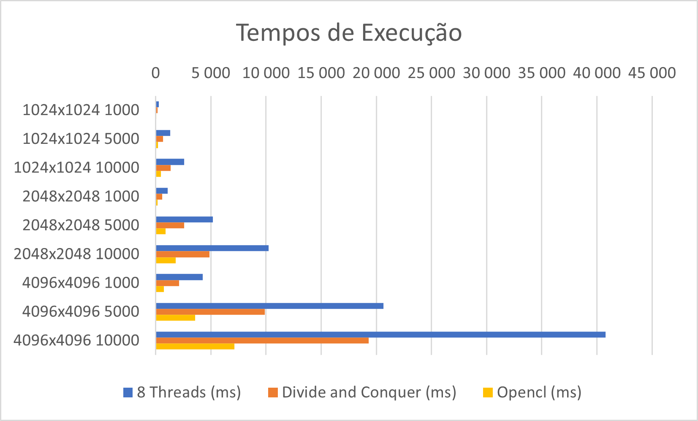

# Fractal MandelBrot – Programação GPU
## Técnicas de Computação Paralela
Mestrado em Engenharia Informática e Sistemas de Informação
 
Universidade Lusófona de Humanidades e Tecnologias
 
Aluno: Thiago Henrique dos Santos – Matrícula: 22100011
 
Professor: Dr. José Rogado

O trabalho consiste no desenvolvimento de um programa em Java que gera um fractal Mandelbrot através da GPU e a análise de desempenho comparada com outras técnicas de paralelização estudadas nesta cadeira. A programação da GPU é feita por **opencl**, através da biblioteca **jocl**. 

- MandelbrotGPU.java – Programa java que implementa a classe principal e executa setup e calls opencl.
- MandelbrotKernel.cl – Kernel de execução para a GPU.

Para este trabalho foi utilizado um computador com processador Intel core i5 10310U de 8 cores, 16GB de RAM e placa de vídeo Intel URD Graphics com 8 GB de RAM compartilhada. 

### Resultados
A tabela a seguir apresenta um comparativo entre os resultados obtidos em cada técnica de programação para as diversas dimensões da matriz e limites de iterações:

| **Dimensão e iterações** | **Sem Parelização (ms)** | **8 Threads (ms)** | **Divide and Conquer (ms)** | **Opencl (ms)** |
| --- | --- | --- | --- | --- |
| 1024x1024 1000 | 1 011 | 287 | 173 | 50 |
| 1024x1024 5000 | 4 312 | 1 319 | 679 | 228 |
| 1024x1024 10000 | 8 495 | 2 579 | 1 340 | 472 |
| 2048x2048 1000 | 3 534 | 1 097 | 584 | 189 |
| 2048x2048 5000 | 17 222 | 5 168 | 2 599 | 897 |
| 2048x2048 10000 | 33 056 | 10 251 | 4 896 | 1 804 |
| 4096x4096 1000 | 13 829 | 4 259 | 2 112 | 755 |
| 4096x4096 5000 | 65 878 | 20 637 | 9 901 | 3 579 |
| 4096x4096 10000 | 131 671 | 40 771 | 19 315 | 7 129 |

O gráfico a seguir apresenta um comparativo dos tempos de execução entre as 3 técnicas de paralelização, possibilitando visualizar que há uma redução do tempo de execução bastante significativa com a implementação de métodos mais sofisticados de paralelização.

### Conclusão
Com este trabalho é possível concluir que a técnica de programação via GPU é a que traz um maior ganho no tempo de execução para cálculo dos elementos de grandes matrizes. Mesmo em um computador que não possui uma placa gráfica de grande desempenho, como no caso da utilizada neste trabalho, o ganho foi na ordem de 3x em relação a técnica Divide and Conquer.